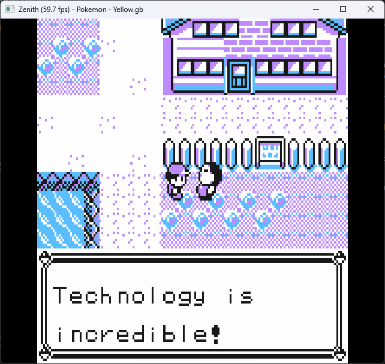
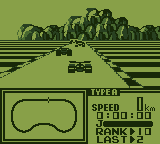
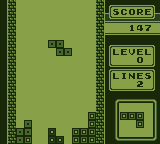
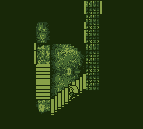
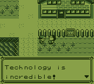
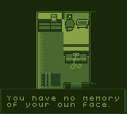
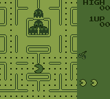
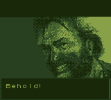
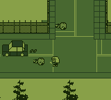
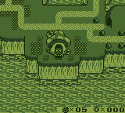

## Zenith.gb

<p align="center">



</p>

Zenith is a Nintendo Game Boy emulator and research project written in Rust. Currently it is in a fully playable state including graphics, audio, save states, controller support and even Game Boy Printer functionality through serial cable emulation. It passes all cpu [instruction and timing tests](https://github.com/retrio/gb-test-roms).

### DMG Screenshots

<p align="center">

|                       |                       |                       |
| :-------------------: | :-------------------: | :-------------------: |
|  |  |  |
|  |  |  |
|  |  |  |

</p>

### Keybinds

| Gameboy button          | Keybind | Secondary keybind |
| ----------------------- | ------- | ----------------- |
| Dpad Up/Left/Down/Right | W/A/S/D | Arrow keys        |
| Button A                | C       | O                 |
| Button B                | V       | P                 |
| Select                  | N       |                   |
| Start                   | M       |                   |

### Todos and non-goals

The next goal for the project is adding Game Boy Color support and iterating on nice-to-have UX features such as changeable keybinds. Other Game Boy models (Game Boy Advance) is currently left outside of the scope of the project for its different architecture and compatibility.

### Running the emulator

The project can be built and run using cargo. [SDL2](https://github.com/Rust-SDL2/rust-sdl2) is used for cross platform video and audio. On windows SDL2.dll needs to be located in the same directory as the binary when linking dynamically.

```bash
cargo run --release
cargo build --release
cargo run path/to/romfile.gb # Additionally a rom file can be passed as the first argument
```

### Tests & benchmarks

Current test suite can be run with `cargo test -r -- --nocapture` _note that the tests print output about different testroms to stdout_. Criterion nenchmarks can be run with `cargo bench`.

### Special mentions

- Gbdev.io https://gbdev.io/
- Pandocs https://gbdev.io/pandocs/
- Complete Game Boy reference https://gekkio.fi/files/gb-docs/gbctr.pdf
- GBEDG https://hacktix.github.io/GBEDG/
